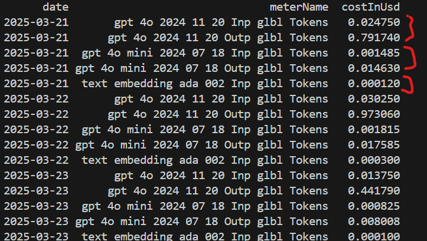
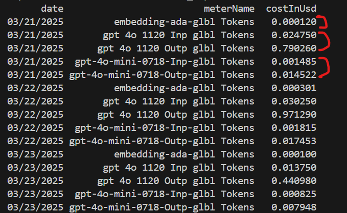

It's an exercise to validate whether AOAI model usage is same as Subscription level cost report.

## Point to remember
- Client side token pricing details can immediately be captured.
- The subscription actually reflects of resouce cost usage a day later.
- Actual tokens price usage data should be very close to the suscription side cost report for resource.

## Client side: tokens pricing data
```
/clients$ python tokens_price.py
```


## Subscription side: meter cost data
```
/pricing$ python generate_cost_details.py
```


